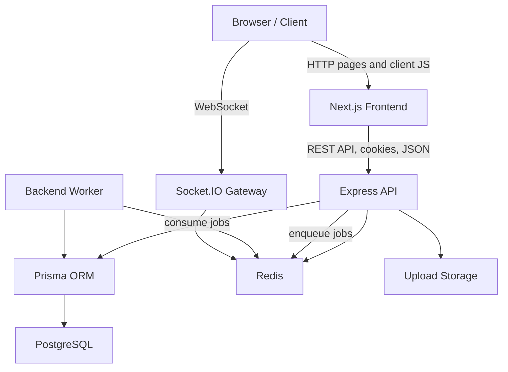
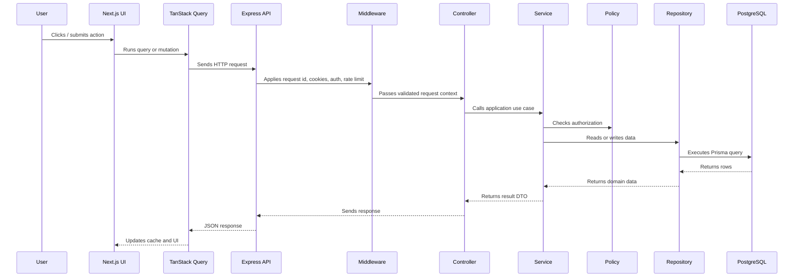
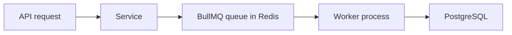

# AtlasSuite Architecture

AtlasSuite is a SaaS-style collaboration platform designed around explicit enterprise boundaries: frontend rendering, API orchestration, durable persistence, ephemeral coordination, realtime messaging, background jobs, and deployment infrastructure.

## System Overview



## Architectural Goals

The system is structured to teach and demonstrate:

- modular backend architecture
- production authentication patterns
- role-based and resource-level authorization
- relational database modeling
- transactional consistency
- queue-based asynchronous work
- realtime collaboration events
- frontend data synchronization
- Dockerized development and production execution
- CI/CD and deployment readiness

## Frontend Architecture

The frontend uses Next.js App Router with React and TypeScript.

```txt
frontend/src/
  app/
    layout.tsx
    providers.tsx
    page.tsx
    login/page.tsx
  api/
    client.ts
  auth/
    AuthContext.tsx
  components/
    ui/
  realtime/
    client.ts
    useRealtimeInvalidation.ts
  views/
    Workspace.tsx
    LoginPage.tsx
    admin/
    jobs/
```

Responsibilities:

- `app/` owns Next.js routes and application shell composition.
- `providers.tsx` wires React Query and authentication context.
- `api/client.ts` centralizes HTTP calls and cookie-aware requests.
- `AuthContext.tsx` owns frontend auth state and session refresh behavior.
- `views/` contains screen-level dashboard experiences.
- `components/ui/` contains reusable visual primitives.
- `realtime/` connects Socket.IO events to query invalidation.

Why this structure exists:

- Routing belongs to Next.js.
- Server/client boundaries stay visible.
- API integration stays out of components.
- Realtime events update cached data instead of manually mutating every screen.
- UI primitives prevent repeated styling decisions.

## Backend Architecture

The backend uses Express with explicit middleware, controller, service, repository, policy, and worker layers.

```txt
backend/src/
  app.ts
  server.ts
  workers.ts
  config.ts
  prisma.ts
  middleware/
  modules/
    auth/
    authorization/
    jobs/
  queues/
  realtime/
  services/
  workers/
```

Layer responsibilities:

| Layer | Responsibility |
| --- | --- |
| `app.ts` | Creates the Express app, middleware chain, and routes |
| `server.ts` | Starts HTTP server and Socket.IO |
| middleware | Cross-cutting request behavior such as auth, errors, request IDs, rate limits |
| controller | Translates HTTP requests into service calls |
| service | Owns business use cases and transactions |
| repository | Encapsulates database access |
| policy | Encapsulates authorization decisions |
| queues | Encapsulates Redis/BullMQ queue setup |
| workers | Processes background jobs outside request latency |
| realtime | Socket.IO authentication, rooms, and event broadcasting |

## Request Lifecycle



## Authentication Architecture

AtlasSuite uses short-lived access tokens and refresh-session rotation.

Core ideas:

- Passwords are hashed with bcrypt before storage.
- Access tokens are short-lived JWTs.
- Refresh sessions are stored server-side so they can be revoked.
- Cookies are HttpOnly to reduce JavaScript token exposure.
- Refresh-token rotation limits replay attacks.
- Email verification and reset-password flows are tokenized and time-limited.

Auth module:

```txt
modules/auth/
  auth.controller.ts
  auth.cookies.ts
  auth.repository.ts
  auth.routes.ts
  auth.schemas.ts
  auth.service.ts
  auth.tokens.ts
```

Security implications:

- JWTs are not used as the only source of truth for long-lived sessions.
- Sensitive mutations are protected by authentication middleware and origin checks.
- Session records allow logout, revocation, audit, and suspicious-session handling.

## Authorization Architecture

Authorization is separated from authentication.

Authentication answers:

```txt
Who is this user?
```

Authorization answers:

```txt
What is this user allowed to do to this resource?
```

Policy example:

```txt
modules/authorization/
  permissions.ts
  job.policy.ts
```

This keeps controllers thin and makes authorization rules testable. For example, a technician can view and update assigned jobs, while a client can only view their own jobs and public notes.

## Database Architecture

PostgreSQL is the durable system of record. Prisma provides typed application access and migrations.

Important data concepts:

- Users have roles.
- Refresh sessions support revocable login sessions.
- Jobs belong to clients and can be assigned to technicians.
- Notes, attachments, audit logs, notifications, and outbox events model operational workflows.
- Indexes support filtering, pagination, search, and role-scoped reads.
- Transactions protect multi-step writes.

Prisma is used for most queries because it provides type safety and migration workflow. Raw SQL is still appropriate when using PostgreSQL-specific features, execution-plan-sensitive queries, or advanced indexing strategies.

## Redis Architecture

Redis is used for fast ephemeral coordination, not durable truth.

Current responsibilities:

- rate limit counters
- BullMQ queue backing store
- Socket.IO Redis adapter support

Future responsibilities can include:

- presence
- short-lived cache entries
- distributed locks where justified

Data that must be correct after restart or eviction belongs in PostgreSQL, not Redis.

## Background Job Architecture

The backend separates request handling from asynchronous work.



This improves:

- request latency
- retry behavior
- failure isolation
- operational scaling

Workers must be idempotent where possible because queued jobs may retry.

## Realtime Architecture

Socket.IO provides realtime collaboration events.

The API authenticates socket connections, assigns users to rooms, and emits events when important data changes. The frontend listens to events and invalidates TanStack Query caches so screens refresh from the API.

This avoids trusting socket payloads as the source of truth. Realtime events say “something changed”; REST APIs still provide canonical data.

## Docker Architecture

Development Compose:

- PostgreSQL
- Redis
- backend API in watch mode
- backend worker in watch mode
- Next.js frontend in dev mode

Production Compose override:

- backend production Dockerfile
- frontend production Dockerfile
- compiled TypeScript
- non-root runtime users
- no watchers
- pruned dependencies

Production backend starts with:

```bash
npm run migrate && node dist/src/server.js
```

Since migrations run at startup here, Prisma CLI is installed as a production dependency. At larger scale, a separate migration job is usually cleaner.

## Scaling Model

AtlasSuite is designed so these components can scale independently:

| Component | Scaling Strategy |
| --- | --- |
| Frontend | Multiple Next.js instances or platform deployment |
| API | Horizontal stateless instances |
| Worker | Separate worker replicas and queue concurrency |
| PostgreSQL | Indexing, pooling, read replicas, partitioning when needed |
| Redis | Managed Redis, clustering if justified |
| Realtime | Socket.IO Redis adapter for multi-instance fanout |
| Uploads | Move from local volume to object storage |

## Security Model

Security is layered:

- bcrypt password hashing
- short-lived JWT access tokens
- refresh-session rotation
- HttpOnly cookies
- trusted-origin checks
- Zod request validation
- RBAC and resource policies
- database constraints
- Redis-backed rate limiting
- audit logging
- non-root Docker runtime users

No single layer is treated as enough. Enterprise systems survive by combining controls.

## Documentation Map

The phase-by-phase architecture notes live in `docs/`:

- `docs/00_MASTERCLASS_ROADMAP.md`
- `docs/01_TARGET_ARCHITECTURE.md`
- `docs/02_PHASE_0_INFRASTRUCTURE.md`
- `docs/03_PHASE_1_BACKEND_FOUNDATION.md`
- later phase documents through testing and production Docker
